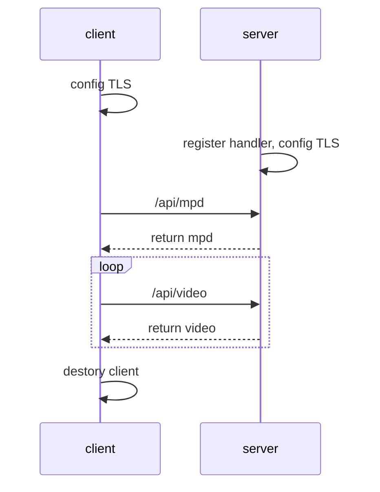

# DASH Ver 时序图

#### /api/mpd

接口地址：https://server_address/mpd
请求方法：GET
接口描述：请求mpd文件
请求参数：None
响应参数：

| 字段名  | 描述       | 数据类型 | 备注                                | 必填 |
| ------- | ---------- | -------- | -----------------------------   | ---- |
| code    | 接口状态码  | Number   | 成功：200                          | 是   |
| message | 接口信息    | String   | 成功：success，失败：提示信息        | 是   |
| data    | 数据        | Object   | xml                              | 是   |

响应状态：

| 接口状态码 | 说明     |
| ---------- | -------- |
| 200        | 成功     |
| 404        | 未找到   |
| 500        | 内部错误 |

#### /api/video

接口地址：https://server_address/video
请求方法：GET
接口描述：请求视频分块
请求参数：

| 字段名             | 描述                             | 数据类型   | 备注                 | 必填 |
|-----------------|--------------------------------|--------|--------------------|----|
| video_name      | 视频名称                           | String | video0,...,video4  | 是  |
| chunk_id        | chunk的id号                      | Number | 1,2,3,4,5,...      | 是  |
| resolution      | 视频分辨率                          | Number | 1920,1080,720      | 是  |
| tiling_scheme   | tiling方案，$rows$ , $cols$         | String | "6,4" | 是  |
| tile_index | tile的下标 | Number | 0,1,2,...         | 是  |

响应参数：

| 字段名  | 描述       | 数据类型 | 备注                          | 必填 |
| ------- | ---------- | -------- | ----------------------------- | ---- |
| code    | 接口状态码 | Number   | 成功：200                     | 是   |
| message | 接口信息   | String   | 成功：success，失败：提示信息 | 是   |
| data    | 视频数据   | Object   | xx.mp4                        | 是   |

响应状态：

| 接口状态码 | 说明     |
| ---------- | -------- |
| 200        | 成功     |
| 404        | 未找到   |
| 500        | 内部错误 |
